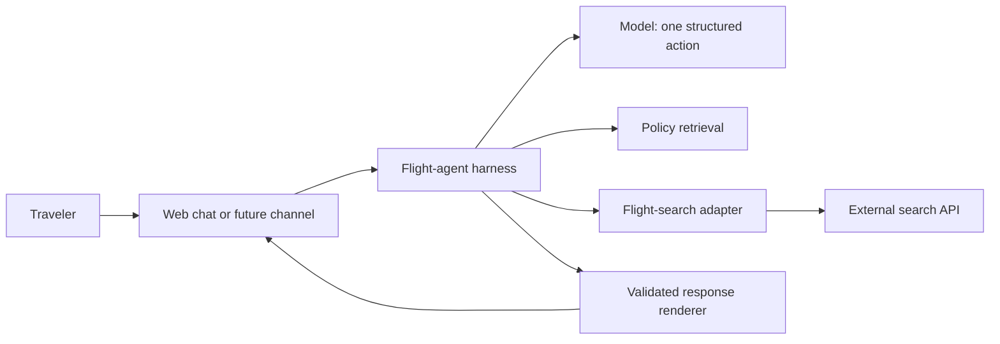

# Flight Agent Lab

A bounded conversational layer over an existing flight-search API. The project
turns natural-language requests into validated search actions, preserves trip
state across follow-ups, grounds policy answers in approved material and renders
concise flight results. It never books or takes payment.

The live demonstration is deployed as an invite-protected Cloud Run service.
The repository is intentionally limited to the independent agent layer. It does
not contain or require the underlying product codebase.

## What the system does



- Interprets complete and partial one-way flight requests
- Applies explicit defaults and asks only for information that is required
- Preserves origin, destination, date, cabin, budget and constraints on follow-up
- Retrieves cited privacy and terms passages for general policy questions
- Proposes explicit travel-preference updates without silently saving them
- Validates every tool action and every backend response
- Records prompt version, model, effort, latency and tokens in evaluation reports

## Current product contract

Supported behavior is frozen in [FROZEN-SCOPE.md](agent/FROZEN-SCOPE.md). The
current prompt is `flight-search-v1.1.0`, described in
[PROMPT-ARCHITECTURE.md](PROMPT-ARCHITECTURE.md).

The assistant is a calm, concise and knowledgeable flight-search concierge. It
asks only necessary questions, preserves supplied details, states limitations
plainly and always offers the next useful step. Customer copy uses short direct
sentences and avoids em dashes and semicolons.

## Architecture

The model is an intent interpreter, not the application. It proposes exactly
one action from a four-tool allowlist:

| Tool | Purpose |
|---|---|
| `find_flights` | Search or refine a trip |
| `lookup_policy` | Retrieve evidence for a policy answer |
| `travel_preferences` | Show or propose explicit saved defaults |
| `clarify_request` | Ask one question or explain a boundary |

Application code owns credentials, state, API calls, response validation,
formatting and call limits. See [ARCHITECTURE-DECISIONS.md](ARCHITECTURE-DECISIONS.md).

## Evidence

- **62 of 62 deterministic checks pass** across routing, state, policy
  retrieval, preferences, output grounding, security and adapter behavior.
- The regression suite separates deterministic checks, model acceptance cases
  and one bounded live-search verification.
- Raw staging captures and transcripts stay local. Version control contains the
  methodology and sanitized aggregate evidence only.

See [EVALUATION.md](EVALUATION.md) for what a pass does and does not prove.

## Security boundary

The project owns a narrow adapter contract and synthetic fixtures. It does not
import from the private product repository. Secrets, account data, raw backend
captures, internal documentation and source snapshots are excluded from Git.
See [SECURITY-BOUNDARY.md](SECURITY-BOUNDARY.md) and the
[publication checklist](PUBLICATION-CHECKLIST.md).

## Run locally

Requires Node.js 24 and pnpm.

```sh
cd agent
pnpm install --frozen-lockfile
pnpm test
pnpm run dashboard
```

Synthetic tests need no API key. The hosted model adapter reads its key from the
deployment secret manager. Credentials must never be added to this repository.

## Why the design stays small

The flow is dynamic enough to benefit from language interpretation and tool
selection, but bounded enough that an autonomous planning loop would add risk
without adding value. Multi-agent coordination, chain-of-thought capture,
automatic retries and MCP are absent by design. New capabilities require a
clear user need, a tool contract and regression cases before they enter scope.
