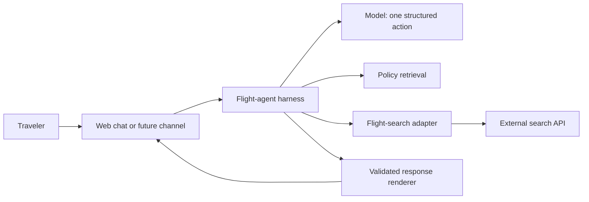
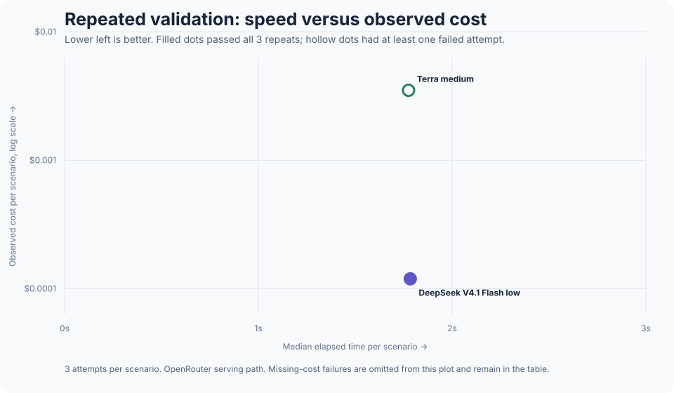

# Flight Agent Lab

A bounded conversational layer over an existing flight-search API. The project
turns natural-language requests into validated search actions, preserves trip
state across follow-ups, grounds policy answers in approved material and renders
concise flight results. It never books or takes payment.

The live demonstration is deployed as an invite-protected Cloud Run service.
The repository is intentionally limited to the independent agent layer. It does
not contain or require the underlying product codebase.

## Project context and authorship

I help with CommonSwyft as a side project. The existing product offers web-based
flight search, and I wanted to explore another way for travelers to access that
capability: a conversational agent that could eventually work through web chat,
WhatsApp or another messaging surface. I used the existing search API boundary
and extended the agent-facing layer around it rather than rebuilding or
publishing the underlying product.

This is a product-led learning project, not a claim that I independently wrote
every line of production code. I am not a software engineer. I framed the
problem, read *Building AI Agents: From Design Patterns to Production*, and used
Codex to help design, implement, test and document the prototype. A later
independent code review, and the held-out repair tests that came from it, used
Claude.

I directed the work and made the product decisions: why an agent could improve
access to flight search, what it should do, what should stay out of scope, which
failures matter, how the conversation should feel, what evidence would support
a model choice, and where security and human approval boundaries belong. I
reviewed the behavior through the live demo and evaluation dashboard,
challenged confusing or incorrect outputs, and iterated on the architecture
with Codex.

The goal is to understand and communicate the system honestly. The code is
included so the decisions can be inspected and reproduced, not to imply that I
implemented it without AI assistance.

The [learning guide](LEARNING-GUIDE.md) is the plain-language walkthrough I use
to make sure I can explain every major component and tradeoff.

The [project handoff](HANDOFF.md) records the current state, access boundaries,
verification steps and next decision so another person or coding agent can
continue without the original chat history.

## What the system does



- Interprets complete and partial one-way flight requests
- Applies explicit defaults and asks only for information that is required
- Preserves origin, destination, date, cabin, budget and constraints on follow-up
- Retrieves cited privacy and terms passages for general policy questions
- Proposes explicit travel-preference updates without silently saving them
- Validates every tool action and every backend response
- Records prompt version, model, effort, latency and tokens in evaluation reports

## Current product contract

Supported behavior is frozen in [FROZEN-SCOPE.md](agent/FROZEN-SCOPE.md). The
current prompt is `flight-search-v1.4.1`, described in
[PROMPT-ARCHITECTURE.md](PROMPT-ARCHITECTURE.md).

The assistant is a calm, concise and knowledgeable flight-search concierge. It
asks only necessary questions, preserves supplied details, states limitations
plainly and always offers the next useful step. Customer copy uses short direct
sentences and avoids em dashes and semicolons.

## Architecture

The model is an intent interpreter, not the application. It proposes exactly
one action from a four-tool allowlist:

| Tool | Purpose |
|---|---|
| `find_flights` | Search or refine a trip |
| `lookup_policy` | Retrieve evidence for a policy answer |
| `travel_preferences` | Show or propose explicit saved defaults |
| `clarify_request` | Ask one question or explain a boundary |

Application code owns credentials, state, API calls, response validation,
formatting and call limits. See [ARCHITECTURE-DECISIONS.md](ARCHITECTURE-DECISIONS.md).

All current model calls use one OpenRouter adapter, including Terra. This keeps
the deployed chat, local live runs and new model evaluations on the same
observable serving path. The earlier Codex SDK reports remain published as
historical evidence and are labelled as a different path. The executable Codex
SDK dependency has been removed.

## Evidence

- **105 of 105 deterministic checks pass** across routing, state, policy
  retrieval, preferences, output grounding, security and adapter behavior.
- The regression suite separates deterministic checks, model acceptance cases
  and one bounded live-search verification.
- Raw staging captures and transcripts stay local. Version control contains the
  methodology and sanitized aggregate evidence only.
- A bounded OpenRouter screen compared Terra medium with DeepSeek, Mistral,
  Qwen and GLM configurations. Repeated validation then ran Terra, DeepSeek
  and GLM three times across the 15-case contract. After prompt and harness
  improvements, DeepSeek passed 45 of 45 attempts twice in full runs. A later
  focused regression confirmed a missed natural-language date. The hosted experiment
  therefore defaults to Terra medium, with DeepSeek and GLM available for
  controlled exploration.

The latest Terra hardening phase added 42 held-out conversations and an
independent Claude Sonnet judge for customer experience. The frozen first run
passed 30 of 42. Its 12 reviews exposed lost dates, ignored baggage constraints
and weak policy or servicing handoffs. Focused corrections then produced a
passing verification for every one of those 12 cases. A later full rerun passed
32 cases, then stopped at B03 when a safe policy handoff did not match the
frozen expected status. Nine cases were not run. The original, interrupted and
stopped evidence remains published, so there is no rewritten perfect baseline
or 42-of-42 claim.

See [EVALUATION.md](EVALUATION.md) for what a pass does and does not prove.
The [`evaluation/`](evaluation/) folder documents the test matrix, comparison
protocol, published evidence and limits of the conclusions.
The [product roadmap](PRODUCT-ROADMAP.md) explains why checkout handoff comes
before autonomous payment and how WhatsApp can reuse the same harness.



The chart shows the repeated OpenRouter validation on one serving path. DeepSeek
was effectively tied with Terra on median latency and cost materially less. The
deployed dashboard retains the earlier screening failures, repeated runs and a
labelled cross-path view of historical Astra, Luna, Sol and Terra evidence.

## Security boundary

The project owns a narrow adapter contract and synthetic fixtures. It does not
import from the private product repository. Secrets, account data, raw backend
captures, internal documentation and source snapshots are excluded from Git.
See [SECURITY-BOUNDARY.md](SECURITY-BOUNDARY.md) and the
[publication checklist](PUBLICATION-CHECKLIST.md). The layered conduct,
grounding, error and cost controls are documented in
[GUARDRAILS.md](GUARDRAILS.md).

## Run locally

Requires Node.js 24 and pnpm.

```sh
cd agent
pnpm install --frozen-lockfile
pnpm test
pnpm run dashboard
```

Synthetic tests need no API key. Local live runs read `OPENROUTER_API_KEY` from
an ignored `.env` file or the process environment. The hosted adapter reads the
same key from the deployment secret manager. Credentials must never be added to
this repository.

## Why the design stays small

The flow is dynamic enough to benefit from language interpretation and tool
selection, but bounded enough that an autonomous planning loop would add risk
without adding value. Multi-agent coordination, chain-of-thought capture,
open-ended retries and MCP are absent by design. Safe reads receive bounded
retries, temporary model HTTP failures receive one budgeted retry, and
operations with uncertain side effects are not retried. See
[RESILIENCE.md](RESILIENCE.md). New capabilities require a clear user need, a
tool contract and regression cases before they enter scope.

## What I should be able to explain

- Why this uses an LLM for language interpretation while keeping execution in
  deterministic application code
- The difference between the agent, its harness, the model and the external
  flight-search backend
- Why live flight availability uses a tool call and policy questions use
  retrieval-augmented generation
- How session state differs from persistent preferences and why preferences
  require explicit confirmation
- How context precedence prevents old state or saved defaults from overriding
  the traveler’s latest request
- Why the model proposes one structured action and cannot call arbitrary APIs
- How response validation, endpoint allowlists, call limits and no automatic
  search retries reduce risk
- What the frozen scope and regression suite establish, and what a passing test
  does not prove
- Why repeated evidence moved DeepSeek forward, then why a live date failure
  moved the experiment default back to Terra
- Why prompt instructions alone were insufficient, and how deterministic
  explicit-field preservation improved both frontier and open-weight behavior
- Why booking, payment, autonomous planning, multi-agent coordination and MCP
  remain outside the current version
