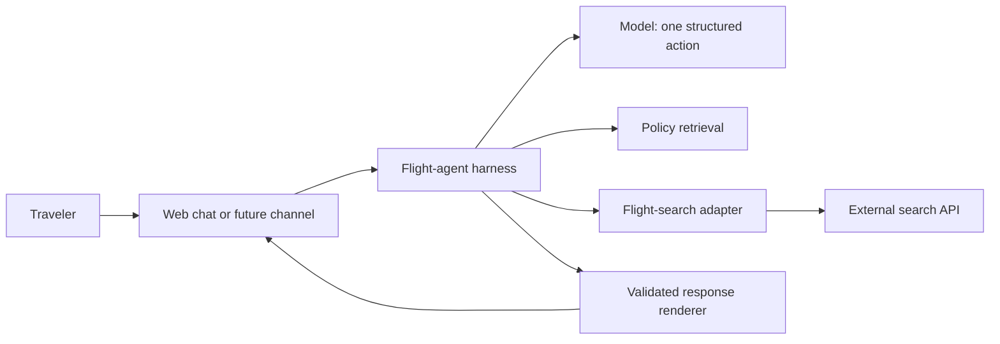

# Flight Agent Lab

A bounded conversational layer over an existing flight-search API. The project
turns natural-language requests into validated search actions, preserves trip
state across follow-ups, grounds policy answers in approved material and renders
concise flight results. It never books or takes payment.

The live demonstration is deployed as a password-gated Cloud Run service.
The repository is intentionally limited to the independent agent layer. It does
not contain or require the underlying product codebase.

## Project context and authorship

I help with CommonSwyft as a side project. The existing product offers web-based
flight search, and I wanted to explore another way for travelers to access that
capability: a conversational agent that could eventually work through web chat,
WhatsApp or another messaging surface. I used the existing search API boundary
and extended the agent-facing layer around it rather than rebuilding or
publishing the underlying product.

This is a product-led project. I am not a software engineer. I framed the
problem, read *Building AI Agents: From Design Patterns to Production*, and used
Codex to design, implement, test and document the prototype. A later independent
code review, and the held-out repair tests that came from it, used Claude.

My part was the product decisions: what the agent should do, what stays out of
scope, which failures matter, how the conversation should feel, what evidence
supports a model choice, and where the security and human approval boundaries
belong. I reviewed behavior through the live demo and the evaluation dashboard,
challenged incorrect outputs and iterated on the architecture with Codex.

The work was a focused two-day sprint in September 2026. The commit history is
the record of what was tried, what failed and what changed. Failed evaluation
runs are preserved rather than rewritten. The code is published for reading and
assessment rather than reuse; see [LICENSE](LICENSE).

The [learning guide](LEARNING-GUIDE.md) is a plain-language walkthrough of every
major component and tradeoff. The [project handoff](HANDOFF.md) records the
current state, access boundaries and next decision for another person or coding
agent.

## What the system does



- Interprets complete and partial one-way flight requests
- Applies explicit defaults and asks only for information that is required
- Preserves origin, destination, date, cabin, budget and constraints on follow-up
- Retrieves cited privacy and terms passages for general policy questions
- Proposes explicit travel-preference updates without silently saving them
- Validates every tool action and every backend response
- Records prompt version, model, effort, latency and tokens in evaluation reports

## Current product contract

Supported behavior is frozen in [FROZEN-SCOPE.md](agent/FROZEN-SCOPE.md). The
current prompt is `flight-search-v1.4.1`, described in
[PROMPT-ARCHITECTURE.md](PROMPT-ARCHITECTURE.md).

The assistant is a calm, concise and knowledgeable flight-search concierge. It
asks only necessary questions, preserves supplied details, states limitations
plainly and always offers the next useful step. Customer copy uses short direct
sentences and avoids em dashes and semicolons.

## Architecture

The model is an intent interpreter, not the application. It proposes exactly
one action from a four-tool allowlist:

| Tool | Purpose |
|---|---|
| `find_flights` | Search or refine a trip |
| `lookup_policy` | Retrieve evidence for a policy answer |
| `travel_preferences` | Show or propose explicit saved defaults |
| `clarify_request` | Ask one question or explain a boundary |

Application code owns credentials, state, API calls, response validation,
formatting and call limits. See [ARCHITECTURE-DECISIONS.md](ARCHITECTURE-DECISIONS.md).

The default model is Terra (OpenAI `gpt-5.6-terra`) at medium reasoning effort.
All current model calls use one OpenRouter adapter, including Terra. This keeps
the deployed chat, local live runs and new model evaluations on the same
observable serving path. The earlier Codex SDK reports remain published as
historical evidence and are labelled as a different path. The executable Codex
SDK dependency has been removed.

## Evidence

- **106 of 106 deterministic checks pass** across routing, state, policy
  retrieval, preferences, output grounding, security and adapter behavior.
  Run them with `pnpm test`; no API key is needed.
- **Model comparison.** A bounded OpenRouter screen compared Terra medium with
  open-weight models: DeepSeek V4.1 Flash, Mistral Small, Qwen 3.6 and GLM 5.3.
  Three-repeat validation then ran the finalists across the 15-case contract.
  DeepSeek low passed 45 of 45 twice and cost less. Terra medium stayed the
  default because it passed one held-out date case that DeepSeek missed. That
  is a product decision on a single new case, not a statistical result. See
  [evaluation/MODEL-COMPARISON.md](evaluation/MODEL-COMPARISON.md).
- **Held-out hardening with an independent judge.** 42 new conversations,
  exact checks plus a Claude Sonnet judge for customer experience. The frozen
  first run passed 30 of 42. The 12 failures were fixed mostly with harness
  rules rather than prompt changes, then verified case by case. A later full
  rerun passed 32 and stopped at B03 on a frozen expectation mismatch. There
  is no 42-of-42 claim. See [evaluation/HARDENING.md](evaluation/HARDENING.md).
- **Second held-out set.** 30 harder cases across place resolution, long
  follow-ups, cross-conversation preferences and payment boundaries. Terra
  passed 17 of 30 on the first run. The report separates product gaps from
  three overly strict test expectations and two judge-context problems. This
  is a baseline for the next changes, not a release score.
- **What is published.** Sanitized per-case reports with visible replies,
  grading, timing, token usage and judge audits. Raw captures, credentials and
  source hashes stay local, so a published run cannot be tied to an exact
  commit. See [EVALUATION.md](EVALUATION.md) for what a pass does and does not
  prove.

The [`evaluation/`](evaluation/) folder documents the test matrix, comparison
protocol, published evidence and limits of the conclusions.
The [product roadmap](PRODUCT-ROADMAP.md) explains why checkout handoff comes
before autonomous payment and how WhatsApp can reuse the same harness.


The chart shows the repeated OpenRouter validation on one serving path. DeepSeek
was effectively tied with Terra on median latency and cost materially less. The
deployed dashboard retains the earlier screening failures, repeated runs and a
labelled cross-path view of historical evidence for four OpenAI models: GPT-6
Astra and GPT-5.6 Sol, Terra and Luna.

## Security boundary

The project owns a narrow adapter contract and synthetic fixtures. It does not
import from the private product repository. Secrets, account data, raw backend
captures, internal documentation and source snapshots are excluded from Git.
See [SECURITY-BOUNDARY.md](SECURITY-BOUNDARY.md) and the
[publication checklist](PUBLICATION-CHECKLIST.md). The layered conduct,
grounding, error and cost controls are documented in
[GUARDRAILS.md](GUARDRAILS.md).

## Run locally

Requires Node.js 24 and pnpm.

```sh
cd agent
pnpm install --frozen-lockfile
pnpm test
pnpm run dashboard
```

The deterministic suite and the recorded dashboard run on synthetic fixtures
and need no API key, so anyone can reproduce the 106 checks. Live flight search
requires credentials that are not in this repository, and live model runs read
`OPENROUTER_API_KEY` from an ignored `.env` file or the process environment.
The hosted adapter reads the same key from the deployment secret manager.
Credentials must never be added to this repository.

## Why the design stays small

The flow is dynamic enough to benefit from language interpretation and tool
selection, but bounded enough that an autonomous planning loop would add risk
without adding value. Multi-agent coordination, chain-of-thought capture,
open-ended retries and MCP are absent by design. Safe reads receive bounded
retries, temporary model HTTP failures receive one budgeted retry, and
operations with uncertain side effects are not retried. See
[RESILIENCE.md](RESILIENCE.md). New capabilities require a clear user need, a
tool contract and regression cases before they enter scope.
