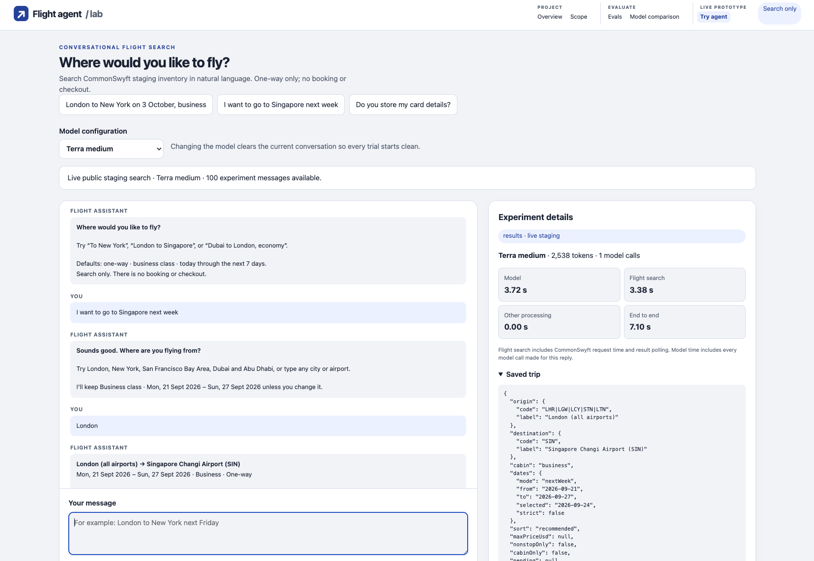
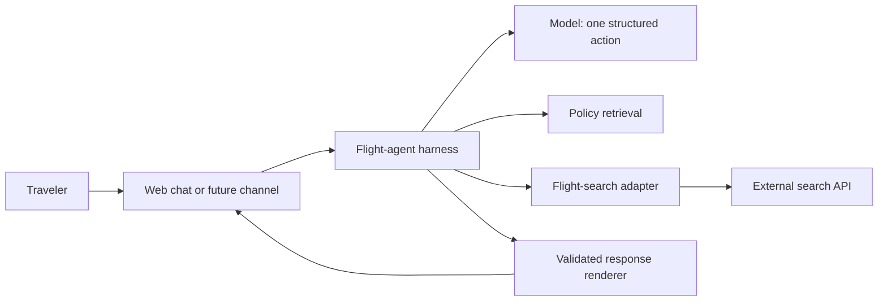
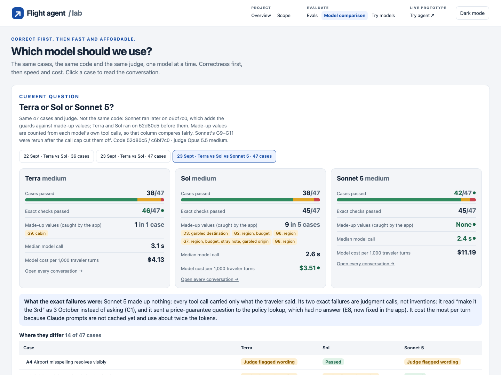
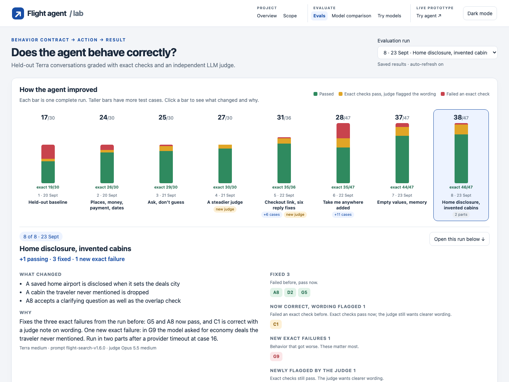

# Flight Agent Lab

[](https://github.com/ayushcchoudhary-hub/flight-agent-lab/actions/workflows/test.yml)

A bounded conversational layer over an existing flight-search API. It turns
natural-language requests into validated search actions, keeps trip details
across follow-ups, answers policy questions from reviewed material and renders
concise flight results. It never books or takes payment. Checkout happens on
the product's own website.

The live demo is a password-protected Cloud Run service. This repository holds
only the independent agent layer. It does not contain or need the underlying
product's code.



A partial request, one clarifying question, then a validated search. The panel
on the right is the trip state the application owns. The model proposes one
action. Application code holds origin, destination, cabin and dates, and times
each stage.

## Project context and authorship

I help with CommonSwyft, a flight-search product, as a side project. The
product offers web-based flight search. I wanted to explore another way for
travelers to reach it: a conversational agent that could work through web
chat, WhatsApp or another messaging channel. I built on the existing search
API and wrote the agent layer around it, rather than rebuilding or publishing
the product.

This is a product-led project. I am not a software engineer. I framed the
problem, read *Building AI Agents: From Design Patterns to Production*, and
directed AI coding agents to design, implement, test and document the
prototype: Codex for the first version, then Claude Code for the evaluation,
hardening and memory work. Commit trailers record which agent co-authored each
change.

My part was the product decisions: what the agent should do, what stays out of
scope, which failures matter, how the conversation should feel, what evidence
supports a model choice, and where the security and human approval boundaries
belong. I reviewed behavior through the live demo and the evaluation pages,
challenged wrong outputs and made the calls on each change.

The work began over a few days in September 2026 and continues as a side
project. The commit history records what was tried, what failed and what
changed. Failed evaluation runs stay published rather than being rewritten.
The code is published to be read and assessed, not reused. See
[LICENSE](LICENSE).

## What it does


```mermaid
flowchart LR
  U[Traveler] --> C[Web chat or future channel]
  C --> H[Flight-agent harness]
  H --> M[Model: one structured action]
  H --> P[Policy retrieval]
  H --> S[Flight-search adapter]
  H --> R[Validated response renderer]
  S --> B[External search API]
  R --> C
```

- Interprets complete and partial one-way flight requests
- Applies stated defaults and asks only for what is required
- Keeps origin, destination, dates, cabin, budget and filters across follow-ups
- "Take me anywhere": shows deals from the product's public deals feed, then
  turns a chosen deal into a normal live search
- Links every set of results to the same search on the product site, where the
  traveler selects and checks out
- Answers privacy and terms questions from a reviewed snapshot with cited
  passages. A weekly check reports when the live pages change
- Remembers a stated home airport and recent searches per browser, and forgets
  them on request. This is built but switched off on the live demo until the
  privacy page covers it. See [docs/MEMORY.md](docs/MEMORY.md)
- Validates every tool action and every backend response before display
- Records prompt version, model, effort, latency and tokens for every
  evaluation run

## Architecture

The model interprets intent. It is not the application. On each turn it
proposes exactly one action from a five-tool allowlist:

| Tool | Purpose |
|---|---|
| `find_flights` | Search or refine a trip |
| `discover_flights` | Show deals when the traveler has no destination ("take me anywhere") |
| `lookup_policy` | Retrieve evidence for a privacy or terms answer |
| `travel_preferences` | Show, propose or forget saved defaults and recent searches |
| `clarify_request` | Ask one question or explain a limitation |

Application code owns credentials, state, API calls, response validation,
formatting and call limits. The model cannot choose a URL, see a credential,
book a flight or create a payment. See
[docs/ARCHITECTURE-DECISIONS.md](docs/ARCHITECTURE-DECISIONS.md) and
[docs/PROMPT-ARCHITECTURE.md](docs/PROMPT-ARCHITECTURE.md).

The default model is Claude Sonnet 5.5 at medium reasoning effort, since 28
September 2026. Sonnet 5 medium, Terra medium, DeepSeek V4.1 Flash low and GLM
5.3 high remain selectable in the live demo for comparison. All model calls go through one
OpenRouter adapter. The current prompt contract is `flight-search-v1.7.0`.
Supported behavior is defined in [agent/FROZEN-SCOPE.md](agent/FROZEN-SCOPE.md).

## Evaluation

- **316 deterministic tests** cover routing, state, policy retrieval, memory,
  output grounding, security and adapter behavior. They run in CI on every
  push and need no API key.
- **A held-out set written before the agent saw it**, graded two ways: exact
  checks decide facts and actions, and an independent LLM judge grades only
  the visible reply. The judge never sees which model it is grading.

How the held-out results moved, one full run per row:

| Date | What changed | Cases | Passed | Exact checks |
|---|---|---:|---:|---:|
| 20 Sep | Baseline, frozen before the first run | 30 | 17 | 19 |
| 20 Sep | Places, currency, payment and date fixes | 30 | 24 | 26 |
| 21 Sep | Ask rather than search on a guess | 30 | 25 | 29 |
| 21 Sep | Judge effort raised after inconsistent grading | 30 | 27 | 30 |
| 22 Sep | Checkout link, six reply fixes, stricter judge | 36 | 31 | 35 |
| 22 Sep | "Take me anywhere" added with 11 new cases | 47 | 28 | 35 |
| 23 Sep | Empty-value fix and origin memory | 47 | 37 | 44 |
| 23 Sep | Invented cabins dropped | 47 | 38 | 46 |

On the same 47 cases, Terra and GPT-6 Sol each passed 38. Claude Sonnet 5
passed 42 and was the only model that invented no values in its tool calls
(Sol 9, Terra 1), so it became the default. On exact checks the three are
within one case, and the judge is a Claude model too, so Sonnet's lead should
be read with that in mind.

On 28 September Sonnet 5 and Sonnet 5.5 ran the same 52 cases on the same
code, with prompt caching on both. Sonnet 5.5 passed 51 with every exact check
and no made-up values, against Sonnet 5's 46 and 51. Its median model call
took 1.6 seconds against 2.8, at about the same cost, so it became the
default. Its one miss was a country airport menu, since fixed in the app.



The case count and the judge change along the way, so rows are not strictly
comparable. Each is one attempt per case: regression evidence, not a
production reliability rate. The full timeline, including the earlier
development-set runs, the model screens and every limit, is in
[docs/evaluation/](docs/evaluation/).



The Evals page opens on the same timeline. Selecting a run shows what changed,
why, and which cases it fixed, newly flagged or newly broke. Every number is
computed from the published reports, never typed by hand. You can open these
pages locally with one command. See [Run it yourself](#run-it-yourself).

## Security boundary

The project owns a narrow adapter contract and synthetic fixtures. It does not
import from the product's private repository. Secrets, account data, raw
backend captures, internal documentation and source snapshots stay out of Git.
See [docs/SECURITY-BOUNDARY.md](docs/SECURITY-BOUNDARY.md),
[docs/GUARDRAILS.md](docs/GUARDRAILS.md) and the
[publication checklist](docs/PUBLICATION-CHECKLIST.md).

## Run it yourself

The live demo is password-protected, but its evaluation pages run on your own
machine with no password and no API key. Requires Node.js 24 and pnpm.

```sh
cd agent
pnpm install --frozen-lockfile
pnpm test
pnpm run dashboard
```

Then open <http://127.0.0.1:5180>. The Evals and Model comparison pages load
the published reports in this repository, so you can open any run and read
every conversation, the exact checks and the judge's audit. Viewing them makes
no model calls.

The tests use synthetic fixtures and need no key either. Live flight search needs
credentials that are not in this repository. Live model runs read
`OPENROUTER_API_KEY` from an ignored `.env` file or the environment.

## Where things live

| Folder | What it holds |
|---|---|
| `agent/src/` | The agent itself: understanding a request, search, memory, policy answers, storage |
| `agent/apps/` | Things you start: the hosted demo server, the local dashboard, the command-line chat |
| `agent/evals/` | Things that measure the agent: test cases, the judge, model comparisons, publishing |
| `agent/tools/` | Maintenance: database setup, airport and policy-snapshot sync |
| `agent/test/` | The deterministic test suite |
| `agent/dashboard/` | The pages for the dashboard and the hosted demo |
| `agent/published-eval-results/` | Sanitized reports from every published evaluation run |

## Why the design stays small

The flow is dynamic enough to benefit from language understanding and tool
selection, but bounded enough that an autonomous planning loop would add risk
without adding value. Multi-agent coordination, chain-of-thought capture,
open-ended retries and MCP are absent by design. Safe reads get bounded
retries, a temporary model HTTP failure gets one budgeted retry, and
operations with uncertain side effects are never retried. See
[docs/RESILIENCE.md](docs/RESILIENCE.md). A new capability needs a clear user
need, a tool contract and regression cases before it enters scope.

## Documents

| Document | Read it for |
|---|---|
| [HANDOFF.md](HANDOFF.md) | Current state, working rules and the next decision |
| [docs/LEARNING-GUIDE.md](docs/LEARNING-GUIDE.md) | A plain-language walkthrough of every component and tradeoff |
| [docs/evaluation/](docs/evaluation/) | The evaluation timeline, methods and limits |
| [docs/MEMORY.md](docs/MEMORY.md) | What the agent remembers, and the plan for memory and retrieval |
| [docs/PRODUCT-ROADMAP.md](docs/PRODUCT-ROADMAP.md) | Why checkout handoff comes before payment, and how WhatsApp fits |
| [agent/FROZEN-SCOPE.md](agent/FROZEN-SCOPE.md) | The behavior contract and every scope change since |
